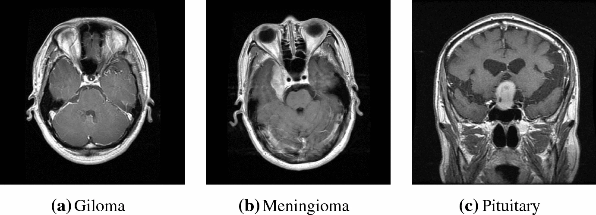

# **VGG16-LR: a novel CNN-based method for brain tumor classification**

Brain tumours pose a serious global health challenge, with the World Health Organization estimating that 251,329 people will die annually due to these tumours. They result from abnormal cell proliferation in the brain and can vary significantly in shape, size, and intensity. Depending on their origin, brain tumours are classified as glioma, meningioma, or pituitary tumours, as shown in **Figure 1**. Among these, gliomas grow in the glial tissues and spinal cord. Meningioma, on the other hand, is a tumour that arises from the meninges, the protective membranes that envelop the brain and spinal cord. Finally, pituitary tumours develop in the pituitary gland area. All three types of tumours cause symptoms such as headaches, seizures, and changes in vision or personality, but subtle differences exist in the symptoms triggered by each category. Hence, accurately differentiating between these tumours is crucial in the subsequent clinical diagnostic process and effective patient assessment. In this project, we proposed a novel CNN-based approach VGG16-LR for brain tumour classification. 



**Figure 1.** Three types of brain tumours (a) Giloma, (b) Meningioma, and (c) Pituitary

## 1. Model Structure

We first fine-tuned the pre-trained VGG16 model, which is then used to extract essential features of brain tumour images. Then we feed the features into a logistic regression to model to further perform brain tumour image classification tasks.


## 2. Install packages

### 2.1 Install PyTorch:  

 Visit the PyTorch website: https://pytorch.org/  and follow the installation instructions based on your system configuration.

### 2.2 Install required dependencies: 

```python
 pip install argparse pillow numpy opencv-python torchvision torch
```

## 3. Usage

```python
python VGG16-LR.py -f the images path -s the predicted results path
```

For example:

```python
python VGG16-LR.py -f './test/' -s ./
```

## 4. Note

The width and height of input images should be over 2.56 cm.
